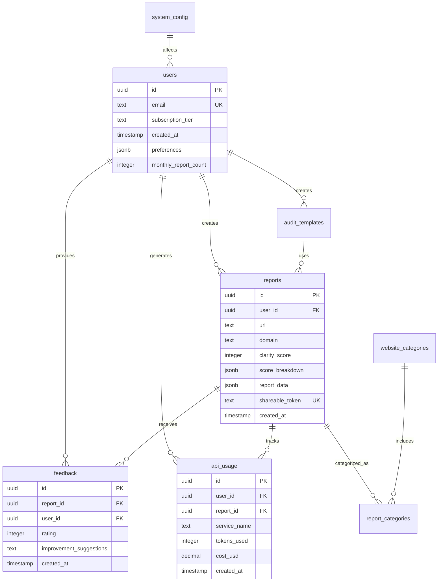

# Entity Relationship Diagram: PlusFolio

**Document Version:** 1.0  
**Date:** August 23, 2025  
**Author:** Database Architecture Team  
**Database:** PostgreSQL (Supabase)

---

## 1. Database Overview

### 1.1. Design Philosophy

**Core Principles:**
- **Scalability:** Designed for 100K+ users with efficient indexing
- **Performance:** Optimized queries with proper foreign keys and constraints
- **Data Integrity:** Strong typing and validation at database level
- **Privacy:** Built-in data anonymization and GDPR compliance
- **Analytics:** Structure optimized for business intelligence queries

### 1.2. Database Statistics (Projected)

| **Entity** | **Expected Volume (Year 1)** | **Growth Rate** | **Storage Impact** |
|:-----------|:------------------------------|:----------------|:-------------------|
| Users | 10,000 | 20%/month | Low |
| Reports | 100,000 | 30%/month | High |
| Feedback | 20,000 | 25%/month | Low |
| API Usage | 1,000,000 | 35%/month | Medium |

---

## 2. Core Entity Definitions

### 2.1. Users Entity

```sql
CREATE TABLE users (
  -- Primary identification
  id UUID PRIMARY KEY DEFAULT gen_random_uuid(),
  email TEXT UNIQUE NOT NULL,
  email_verified BOOLEAN DEFAULT false,
  
  -- Authentication
  auth_provider TEXT NOT NULL DEFAULT 'email', -- 'email', 'google', 'github'
  auth_provider_id TEXT,
  password_hash TEXT, -- Only for email auth
  
  -- Profile information
  full_name TEXT,
  avatar_url TEXT,
  company TEXT,
  website TEXT,
  
  -- Subscription management
  subscription_tier TEXT NOT NULL DEFAULT 'free', -- 'free', 'pro', 'enterprise'
  subscription_status TEXT DEFAULT 'active', -- 'active', 'past_due', 'canceled'
  subscription_expires_at TIMESTAMP WITH TIME ZONE,
  stripe_customer_id TEXT UNIQUE,
  stripe_subscription_id TEXT,
  
  -- Usage tracking
  monthly_report_count INTEGER DEFAULT 0,
  last_report_reset DATE DEFAULT CURRENT_DATE,
  total_reports_generated INTEGER DEFAULT 0,
  
  -- Metadata
  created_at TIMESTAMP WITH TIME ZONE DEFAULT NOW(),
  updated_at TIMESTAMP WITH TIME ZONE DEFAULT NOW(),
  last_login_at TIMESTAMP WITH TIME ZONE,
  is_active BOOLEAN DEFAULT true,
  
  -- Preferences
  preferences JSONB DEFAULT '{}', -- UI preferences, notification settings
  
  -- Analytics
  utm_source TEXT, -- Marketing attribution
  utm_medium TEXT,
  utm_campaign TEXT,
  referral_source TEXT,
  
  CONSTRAINT valid_subscription_tier 
    CHECK (subscription_tier IN ('free', 'pro', 'enterprise')),
  CONSTRAINT valid_auth_provider 
    CHECK (auth_provider IN ('email', 'google', 'github'))
);

-- Indexes for performance
CREATE INDEX idx_users_email ON users(email);
CREATE INDEX idx_users_subscription ON users(subscription_tier, subscription_status);
CREATE INDEX idx_users_stripe_customer ON users(stripe_customer_id);
CREATE INDEX idx_users_created_at ON users(created_at);
CREATE INDEX idx_users_last_login ON users(last_login_at);
```

### 2.2. Reports Entity

```sql
CREATE TABLE reports (
  -- Primary identification
  id UUID PRIMARY KEY DEFAULT gen_random_uuid(),
  user_id UUID REFERENCES users(id) ON DELETE CASCADE,
  
  -- Website information
  url TEXT NOT NULL,
  final_url TEXT, -- After redirects
  domain TEXT NOT NULL,
  title TEXT,
  description TEXT,
  
  -- Analysis configuration
  analysis_mode TEXT NOT NULL DEFAULT 'comprehensive', 
    -- 'comprehensive', 'recruiter', 'peer', 'client', 'quick'
  analysis_version TEXT NOT NULL DEFAULT '1.0', -- For A/B testing different algorithms
  
  -- Scoring
  clarity_score INTEGER NOT NULL CHECK (clarity_score >= 0 AND clarity_score <= 100),
  score_breakdown JSONB NOT NULL, -- {design: 85, ux: 90, technical: 75, accessibility: 80}
  previous_score INTEGER, -- For comparison
  score_trend TEXT, -- 'improved', 'declined', 'unchanged'
  
  -- Processing metadata
  processing_time_ms INTEGER,
  processing_status TEXT DEFAULT 'completed', -- 'processing', 'completed', 'failed', 'partial'
  error_message TEXT,
  retry_count INTEGER DEFAULT 0,
  
  -- AI analysis results
  report_data JSONB NOT NULL, -- Full analysis results
  ai_model_used TEXT, -- 'gemini-2.5-flash', 'gemini-2.5-pro', 'gemini-2.5-flash-lite'
  ai_cost_usd DECIMAL(10,6), -- Cost tracking for each analysis
  
  -- Sharing and visibility
  shareable_token TEXT UNIQUE, -- Public sharing token
  is_public BOOLEAN DEFAULT false,
  share_expires_at TIMESTAMP WITH TIME ZONE,
  view_count INTEGER DEFAULT 0,
  
  -- External service tracking
  crawl_service TEXT, -- 'firecrawl', 'crawl4ai', 'manual'
  screenshot_service TEXT, -- 'capturekit', 'screenshotone', 'manual'
  
  -- Timestamps
  created_at TIMESTAMP WITH TIME ZONE DEFAULT NOW(),
  updated_at TIMESTAMP WITH TIME ZONE DEFAULT NOW(),
  
  CONSTRAINT valid_analysis_mode 
    CHECK (analysis_mode IN ('comprehensive', 'recruiter', 'peer', 'client', 'quick')),
  CONSTRAINT valid_processing_status 
    CHECK (processing_status IN ('processing', 'completed', 'failed', 'partial'))
);

-- Indexes for performance
CREATE INDEX idx_reports_user_id ON reports(user_id);
CREATE INDEX idx_reports_domain ON reports(domain);
CREATE INDEX idx_reports_created_at ON reports(created_at DESC);
CREATE INDEX idx_reports_clarity_score ON reports(clarity_score);
CREATE INDEX idx_reports_shareable_token ON reports(shareable_token) WHERE shareable_token IS NOT NULL;
CREATE INDEX idx_reports_public ON reports(is_public) WHERE is_public = true;
CREATE INDEX idx_reports_processing_status ON reports(processing_status);

-- Composite indexes for common queries
CREATE INDEX idx_reports_user_created ON reports(user_id, created_at DESC);
CREATE INDEX idx_reports_domain_score ON reports(domain, clarity_score DESC);
```

### 2.3. Feedback Entity

```sql
CREATE TABLE feedback (
  -- Primary identification
  id UUID PRIMARY KEY DEFAULT gen_random_uuid(),
  report_id UUID NOT NULL REFERENCES reports(id) ON DELETE CASCADE,
  user_id UUID REFERENCES users(id) ON DELETE SET NULL, -- Allow anonymous feedback
  
  -- Feedback content
  rating INTEGER NOT NULL CHECK (rating >= 1 AND rating <= 5),
  helpful_insights TEXT[], -- Array of insight IDs that were helpful
  unhelpful_insights TEXT[], -- Array of insight IDs that were not helpful
  accuracy_rating INTEGER CHECK (accuracy_rating >= 1 AND accuracy_rating <= 5),
  
  -- Detailed feedback
  improvement_suggestions TEXT,
  specific_feedback JSONB, -- Structured feedback for different report sections
  
  -- Context
  user_role TEXT, -- 'developer', 'designer', 'founder', 'other'
  experience_level TEXT, -- 'beginner', 'intermediate', 'advanced'
  
  -- Metadata
  created_at TIMESTAMP WITH TIME ZONE DEFAULT NOW(),
  ip_address INET, -- For spam prevention
  user_agent TEXT, -- For analytics
  
  -- ML training flags
  used_for_training BOOLEAN DEFAULT false,
  training_weight DECIMAL(3,2) DEFAULT 1.0, -- Weight for ML training
  
  CONSTRAINT one_feedback_per_user_report UNIQUE(report_id, user_id)
);

-- Indexes
CREATE INDEX idx_feedback_report_id ON feedback(report_id);
CREATE INDEX idx_feedback_rating ON feedback(rating);
CREATE INDEX idx_feedback_created_at ON feedback(created_at);
CREATE INDEX idx_feedback_training ON feedback(used_for_training) WHERE used_for_training = true;
```

### 2.4. API Usage Tracking

```sql
CREATE TABLE api_usage (
  -- Primary identification
  id UUID PRIMARY KEY DEFAULT gen_random_uuid(),
  user_id UUID REFERENCES users(id) ON DELETE CASCADE,
  report_id UUID REFERENCES reports(id) ON DELETE CASCADE,
  
  -- API call details
  service_name TEXT NOT NULL, -- 'firecrawl', 'capturekit', 'gemini', 'crawl4ai'
  endpoint TEXT,
  method TEXT DEFAULT 'POST',
  
  -- Usage metrics
  tokens_used INTEGER,
  processing_time_ms INTEGER,
  success BOOLEAN NOT NULL,
  error_code TEXT,
  error_message TEXT,
  
  -- Cost tracking
  cost_usd DECIMAL(10,6),
  billing_tier TEXT, -- 'free', 'pro', 'enterprise'
  
  -- Request/response data (for debugging)
  request_size_bytes INTEGER,
  response_size_bytes INTEGER,
  request_headers JSONB,
  
  -- Metadata
  created_at TIMESTAMP WITH TIME ZONE DEFAULT NOW(),
  ip_address INET,
  user_agent TEXT,
  
  CONSTRAINT valid_service_name 
    CHECK (service_name IN ('firecrawl', 'capturekit', 'screenshotone', 'gemini', 'crawl4ai'))
);

-- Indexes for analytics and billing
CREATE INDEX idx_api_usage_user_id ON api_usage(user_id);
CREATE INDEX idx_api_usage_service ON api_usage(service_name);
CREATE INDEX idx_api_usage_created_at ON api_usage(created_at);
CREATE INDEX idx_api_usage_cost ON api_usage(cost_usd) WHERE cost_usd IS NOT NULL;

-- Partitioning for large datasets
CREATE INDEX idx_api_usage_monthly ON api_usage(date_trunc('month', created_at));
```

---

## 3. Supporting Entities

### 3.1. Website Categories

```sql
CREATE TABLE website_categories (
  id UUID PRIMARY KEY DEFAULT gen_random_uuid(),
  name TEXT UNIQUE NOT NULL,
  description TEXT,
  keywords TEXT[],
  created_at TIMESTAMP WITH TIME ZONE DEFAULT NOW()
);

-- Junction table for many-to-many relationship
CREATE TABLE report_categories (
  report_id UUID REFERENCES reports(id) ON DELETE CASCADE,
  category_id UUID REFERENCES website_categories(id) ON DELETE CASCADE,
  confidence_score DECIMAL(3,2), -- AI confidence in categorization
  PRIMARY KEY (report_id, category_id)
);

-- Seed data for common website types
INSERT INTO website_categories (name, description, keywords) VALUES
('Portfolio', 'Personal or professional portfolio websites', ARRAY['portfolio', 'personal', 'resume', 'cv']),
('E-commerce', 'Online stores and shopping websites', ARRAY['shop', 'store', 'cart', 'buy', 'product']),
('Blog', 'Blogging and content websites', ARRAY['blog', 'article', 'post', 'news']),
('Corporate', 'Company and business websites', ARRAY['company', 'business', 'corporate', 'about']),
('Landing Page', 'Marketing and conversion-focused pages', ARRAY['landing', 'cta', 'signup', 'conversion']),
('SaaS', 'Software as a Service applications', ARRAY['saas', 'software', 'app', 'platform', 'dashboard']);
```

### 3.2. Audit Templates

```sql
CREATE TABLE audit_templates (
  id UUID PRIMARY KEY DEFAULT gen_random_uuid(),
  name TEXT NOT NULL,
  description TEXT,
  analysis_mode TEXT NOT NULL,
  
  -- Template configuration
  scoring_weights JSONB NOT NULL, -- {design: 0.3, ux: 0.4, technical: 0.2, accessibility: 0.1}
  evaluation_criteria JSONB NOT NULL, -- Detailed criteria for each category
  
  -- Target audience
  target_categories UUID[] REFERENCES website_categories(id),
  target_user_roles TEXT[], -- 'recruiter', 'peer', 'client'
  
  -- Metadata
  created_by UUID REFERENCES users(id),
  is_default BOOLEAN DEFAULT false,
  is_active BOOLEAN DEFAULT true,
  created_at TIMESTAMP WITH TIME ZONE DEFAULT NOW(),
  updated_at TIMESTAMP WITH TIME ZONE DEFAULT NOW()
);
```

### 3.3. System Configuration

```sql
CREATE TABLE system_config (
  key TEXT PRIMARY KEY,
  value JSONB NOT NULL,
  description TEXT,
  updated_at TIMESTAMP WITH TIME ZONE DEFAULT NOW(),
  updated_by UUID REFERENCES users(id)
);

-- Configuration examples
INSERT INTO system_config (key, value, description) VALUES
('ai_models', '{"primary": "gemini-2.5-flash", "advanced": "gemini-2.5-pro", "cost_optimizer": "gemini-2.5-flash-lite"}', 'AI model configuration'),
('rate_limits', '{"free": {"daily": 3, "monthly": 10}, "pro": {"daily": 50, "monthly": 500}}', 'Rate limiting configuration'),
('feature_flags', '{"advanced_analysis": true, "pdf_export": true, "api_access": false}', 'Feature flag settings'),
('scoring_algorithm', '{"version": "2.1", "weights": {"design": 0.25, "ux": 0.35, "technical": 0.25, "accessibility": 0.15}}', 'Current scoring algorithm');
```

---

## 4. Entity Relationships

### 4.1. Core Relationship Diagram



### 4.2. Relationship Details

**One-to-Many Relationships:**
- User → Reports (One user can create many reports)
- User → Feedback (One user can provide feedback on many reports)  
- Report → Feedback (One report can receive feedback from many users)
- User → API Usage (One user generates many API usage records)
- Report → API Usage (One report generates multiple API calls)

**Many-to-Many Relationships:**
- Reports ↔ Categories (Many reports can belong to many categories)
- Templates ↔ Categories (Many templates can target many categories)

**Self-Referencing Relationships:**
- Reports can reference previous reports for comparison (previous_score field)

---

## 5. Database Constraints & Validation

### 5.1. Data Integrity Constraints

```sql
-- Ensure subscription logic is consistent
ALTER TABLE users ADD CONSTRAINT valid_subscription_dates
  CHECK (
    (subscription_tier = 'free') OR 
    (subscription_tier != 'free' AND subscription_expires_at IS NOT NULL)
  );

-- Ensure report scores are consistent
ALTER TABLE reports ADD CONSTRAINT consistent_score_data
  CHECK (
    (processing_status = 'completed' AND clarity_score IS NOT NULL) OR
    (processing_status != 'completed')
  );

-- Ensure sharing logic is consistent
ALTER TABLE reports ADD CONSTRAINT valid_sharing_config
  CHECK (
    (is_public = false) OR 
    (is_public = true AND shareable_token IS NOT NULL)
  );

-- Prevent feedback spam
ALTER TABLE feedback ADD CONSTRAINT reasonable_feedback_timing
  CHECK (created_at >= (SELECT created_at FROM reports WHERE id = report_id));
```

### 5.2. Performance Constraints

```sql
-- Automatic cleanup of old data
CREATE OR REPLACE FUNCTION cleanup_old_api_usage()
RETURNS void AS $$
BEGIN
  -- Keep only 3 months of API usage data for analytics
  DELETE FROM api_usage 
  WHERE created_at < NOW() - INTERVAL '3 months';
END;
$$ LANGUAGE plpgsql;

-- Schedule cleanup (requires pg_cron extension)
SELECT cron.schedule('cleanup-api-usage', '0 2 * * *', 'SELECT cleanup_old_api_usage();');
```

---

## 6. Data Access Patterns

### 6.1. Common Query Patterns

```sql
-- User dashboard: Recent reports with scores
SELECT r.id, r.url, r.clarity_score, r.created_at,
       r.score_breakdown->>'design' as design_score,
       r.score_breakdown->>'ux' as ux_score
FROM reports r
WHERE r.user_id = $1 
  AND r.processing_status = 'completed'
ORDER BY r.created_at DESC
LIMIT 10;

-- Public reports leaderboard
SELECT r.url, r.domain, r.clarity_score, r.view_count
FROM reports r
WHERE r.is_public = true 
  AND r.processing_status = 'completed'
ORDER BY r.clarity_score DESC, r.view_count DESC
LIMIT 50;

-- User analytics: Score trends
SELECT date_trunc('week', created_at) as week,
       AVG(clarity_score) as avg_score,
       COUNT(*) as report_count
FROM reports
WHERE user_id = $1 
  AND created_at >= NOW() - INTERVAL '3 months'
GROUP BY week
ORDER BY week;

-- Cost analysis per user
SELECT u.email, u.subscription_tier,
       SUM(a.cost_usd) as total_cost,
       COUNT(DISTINCT a.report_id) as report_count
FROM users u
JOIN api_usage a ON u.id = a.user_id
WHERE a.created_at >= date_trunc('month', NOW())
GROUP BY u.id, u.email, u.subscription_tier
ORDER BY total_cost DESC;
```

### 6.2. Analytical Queries

```sql
-- Conversion funnel analysis
WITH user_metrics AS (
  SELECT 
    u.id,
    u.subscription_tier,
    COUNT(r.id) as total_reports,
    AVG(f.rating) as avg_feedback_rating,
    MAX(r.created_at) as last_report_date
  FROM users u
  LEFT JOIN reports r ON u.id = r.user_id
  LEFT JOIN feedback f ON r.id = f.report_id
  WHERE u.created_at >= NOW() - INTERVAL '30 days'
  GROUP BY u.id, u.subscription_tier
)
SELECT 
  subscription_tier,
  COUNT(*) as user_count,
  AVG(total_reports) as avg_reports_per_user,
  AVG(avg_feedback_rating) as avg_satisfaction,
  COUNT(CASE WHEN last_report_date >= NOW() - INTERVAL '7 days' THEN 1 END) as active_users
FROM user_metrics
GROUP BY subscription_tier;

-- Feature usage analytics
SELECT 
  r.analysis_mode,
  COUNT(*) as usage_count,
  AVG(r.clarity_score) as avg_score,
  AVG(f.rating) as avg_rating
FROM reports r
LEFT JOIN feedback f ON r.id = f.report_id
WHERE r.created_at >= NOW() - INTERVAL '30 days'
GROUP BY r.analysis_mode
ORDER BY usage_count DESC;
```

---

## 7. Security & Privacy

### 7.1. Row Level Security (RLS)

```sql
-- Enable RLS on all user-related tables
ALTER TABLE users ENABLE ROW LEVEL SECURITY;
ALTER TABLE reports ENABLE ROW LEVEL SECURITY;
ALTER TABLE feedback ENABLE ROW LEVEL SECURITY;
ALTER TABLE api_usage ENABLE ROW LEVEL SECURITY;

-- Users can only see their own data
CREATE POLICY user_own_data ON users
  FOR ALL USING (auth.uid() = id);

-- Users can see their own reports + public reports
CREATE POLICY user_reports ON reports
  FOR SELECT USING (
    auth.uid() = user_id OR 
    (is_public = true AND processing_status = 'completed')
  );

-- Users can only modify their own reports
CREATE POLICY user_modify_reports ON reports
  FOR INSERT WITH CHECK (auth.uid() = user_id);

CREATE POLICY user_update_reports ON reports
  FOR UPDATE USING (auth.uid() = user_id);

-- Feedback policies
CREATE POLICY feedback_read ON feedback
  FOR SELECT USING (
    auth.uid() = user_id OR 
    auth.uid() = (SELECT user_id FROM reports WHERE id = report_id)
  );

CREATE POLICY feedback_create ON feedback
  FOR INSERT WITH CHECK (
    auth.uid() = user_id OR user_id IS NULL -- Allow anonymous feedback
  );
```

### 7.2. Data Anonymization

```sql
-- Function to anonymize user data for GDPR compliance
CREATE OR REPLACE FUNCTION anonymize_user_data(target_user_id UUID)
RETURNS void AS $$
BEGIN
  -- Anonymize personal information
  UPDATE users SET
    email = 'deleted-user-' || target_user_id::text || '@example.com',
    full_name = 'Deleted User',
    avatar_url = NULL,
    company = NULL,
    website = NULL,
    preferences = '{}',
    utm_source = NULL,
    utm_medium = NULL,
    utm_campaign = NULL,
    referral_source = NULL
  WHERE id = target_user_id;
  
  -- Keep reports but anonymize URLs if requested
  UPDATE reports SET
    url = 'https://anonymized-site-' || id::text || '.example.com',
    final_url = NULL,
    title = 'Anonymized Site',
    description = 'Site description removed for privacy'
  WHERE user_id = target_user_id;
  
  -- Remove detailed API usage data but keep aggregated statistics
  DELETE FROM api_usage 
  WHERE user_id = target_user_id;
END;
$$ LANGUAGE plpgsql;
```

---

## 8. Backup & Recovery Strategy

### 8.1. Backup Configuration

```sql
-- Critical data prioritization for backups
CREATE VIEW backup_priority_data AS
SELECT 'users' as table_name, 1 as priority, COUNT(*) as row_count FROM users
UNION ALL
SELECT 'reports', 1, COUNT(*) FROM reports WHERE processing_status = 'completed'
UNION ALL
SELECT 'feedback', 2, COUNT(*) FROM feedback
UNION ALL
SELECT 'api_usage', 3, COUNT(*) FROM api_usage WHERE created_at >= NOW() - INTERVAL '30 days';

-- Point-in-time recovery testing query
SELECT 
  schemaname, 
  tablename, 
  n_tup_ins as inserts,
  n_tup_upd as updates,
  n_tup_del as deletes
FROM pg_stat_user_tables 
ORDER BY n_tup_ins + n_tup_upd + n_tup_del DESC;
```

### 8.2. Disaster Recovery

```sql
-- Database health check function
CREATE OR REPLACE FUNCTION database_health_check()
RETURNS TABLE(
  check_name TEXT,
  status TEXT,
  details TEXT
) AS $$
BEGIN
  -- Check table sizes
  RETURN QUERY
  SELECT 
    'Table Size Check' as check_name,
    CASE 
      WHEN pg_total_relation_size('reports') > 10 * 1024 * 1024 * 1024 THEN 'WARNING'
      ELSE 'OK'
    END as status,
    pg_size_pretty(pg_total_relation_size('reports')) as details;
    
  -- Check constraint violations
  RETURN QUERY
  SELECT 
    'Data Integrity Check' as check_name,
    CASE 
      WHEN EXISTS (SELECT 1 FROM reports WHERE clarity_score > 100) THEN 'ERROR'
      ELSE 'OK'
    END as status,
    'Clarity scores within valid range' as details;
END;
$$ LANGUAGE plpgsql;
```

---

## 9. Migration Strategy

### 9.1. Schema Versioning

```sql
-- Schema version tracking
CREATE TABLE schema_migrations (
  version TEXT PRIMARY KEY,
  applied_at TIMESTAMP WITH TIME ZONE DEFAULT NOW(),
  description TEXT
);

-- Example migration for adding new features
CREATE OR REPLACE FUNCTION migrate_to_v2_0()
RETURNS void AS $$
BEGIN
  -- Add new columns for advanced analytics
  IF NOT EXISTS (SELECT 1 FROM information_schema.columns 
                WHERE table_name = 'reports' AND column_name = 'analysis_version') THEN
    ALTER TABLE reports ADD COLUMN analysis_version TEXT DEFAULT '1.0';
  END IF;
  
  -- Insert migration record
  INSERT INTO schema_migrations (version, description) 
  VALUES ('2.0.0', 'Added analysis versioning for A/B testing')
  ON CONFLICT (version) DO NOTHING;
END;
$$ LANGUAGE plpgsql;
```

### 9.2. Data Migration Scripts

```sql
-- Migrate legacy score format to new structure
CREATE OR REPLACE FUNCTION migrate_score_breakdown()
RETURNS void AS $$
BEGIN
  UPDATE reports 
  SET score_breakdown = jsonb_build_object(
    'design', COALESCE((report_data->>'design_score')::integer, 0),
    'ux', COALESCE((report_data->>'ux_score')::integer, 0),
    'technical', COALESCE((report_data->>'technical_score')::integer, 0),
    'accessibility', COALESCE((report_data->>'accessibility_score')::integer, 0)
  )
  WHERE score_breakdown IS NULL OR score_breakdown = '{}'::jsonb;
END;
$$ LANGUAGE plpgsql;
```

---

## 10. Performance Optimization

### 10.1. Database Tuning

```sql
-- Recommended PostgreSQL settings for this workload
-- postgresql.conf settings:
/*
shared_buffers = 256MB
effective_cache_size = 1GB
maintenance_work_mem = 64MB
checkpoint_completion_target = 0.9
wal_buffers = 16MB
default_statistics_target = 100
random_page_cost = 1.1  -- For SSD storage
*/

-- Query optimization
EXPLAIN (ANALYZE, BUFFERS) 
SELECT r.id, r.url, r.clarity_score 
FROM reports r 
WHERE r.user_id = $1 
ORDER BY r.created_at DESC 
LIMIT 10;

-- Index usage analysis
SELECT schemaname, tablename, attname, n_distinct, correlation
FROM pg_stats
WHERE tablename IN ('users', 'reports', 'feedback', 'api_usage')
ORDER BY tablename, attname;
```

### 10.2. Partitioning Strategy

```sql
-- Partition API usage by month for better performance
CREATE TABLE api_usage_partitioned (
  LIKE api_usage INCLUDING ALL
) PARTITION BY RANGE (created_at);

-- Create monthly partitions
CREATE TABLE api_usage_2024_01 PARTITION OF api_usage_partitioned
  FOR VALUES FROM ('2024-01-01') TO ('2024-02-01');

CREATE TABLE api_usage_2024_02 PARTITION OF api_usage_partitioned
  FOR VALUES FROM ('2024-02-01') TO ('2024-03-01');

-- Automatic partition management
CREATE OR REPLACE FUNCTION create_monthly_partition()
RETURNS void AS $$
DECLARE
  start_date DATE;
  end_date DATE;
  partition_name TEXT;
BEGIN
  start_date := date_trunc('month', CURRENT_DATE + INTERVAL '1 month');
  end_date := start_date + INTERVAL '1 month';
  partition_name := 'api_usage_' || to_char(start_date, 'YYYY_MM');
  
  EXECUTE format('CREATE TABLE IF NOT EXISTS %I PARTITION OF api_usage_partitioned
                  FOR VALUES FROM (%L) TO (%L)',
                 partition_name, start_date, end_date);
END;
$$ LANGUAGE plpgsql;

-- Schedule monthly partition creation
SELECT cron.schedule('create-partition', '0 0 25 * *', 'SELECT create_monthly_partition();');
```

---

## Conclusion

This ERD provides a comprehensive foundation for PlusFolio's data architecture, designed to support:

- **Scalable User Management:** Flexible subscription tiers with usage tracking
- **Comprehensive Analytics:** Detailed reporting and feedback collection
- **Cost Optimization:** Granular API usage tracking for cost management
- **Data Privacy:** GDPR-compliant anonymization and RLS security
- **Performance:** Optimized indexes and partitioning for growth

The schema is designed to evolve with the product while maintaining data integrity and performance as the platform scales to thousands of users and millions of reports.