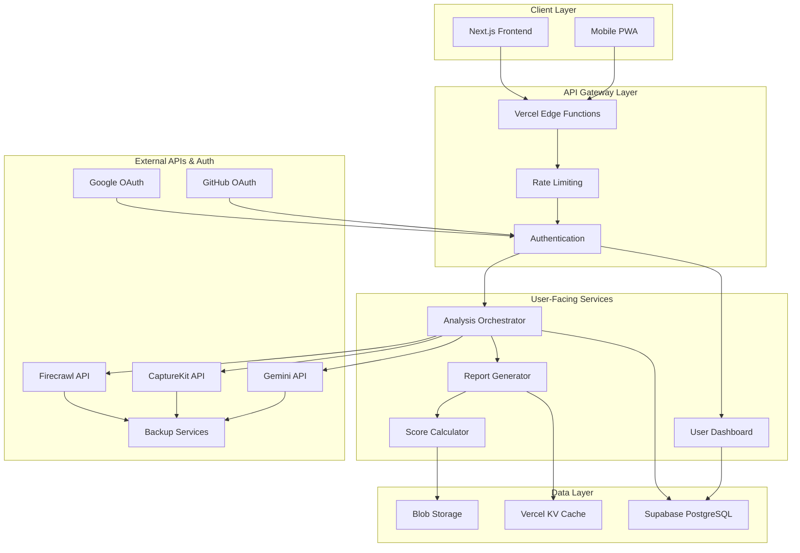

# Technical Architecture: PlusFolio

**Document Version:** 1.0  
**Date:** August 23, 2025  
**Author:** Technical Architecture Team  
**Status:** Initial Design

---

## 1. System Overview

### 1.1. Architecture Philosophy

**Core Principles:**
- **Serverless-First:** Automatic scaling, pay-per-use, zero infrastructure management
- **API-Driven:** Modular services with clear interfaces and fallback strategies  
- **Performance-Optimized:** Sub-60-second processing with intelligent caching
- **Cost-Efficient:** Tiered resource allocation based on user tier and demand
- **Resilient:** Multiple provider strategy with graceful degradation

### 1.2. High-Level Architecture



---

## 2. Technology Stack

### 2.1. Frontend Stack

**Framework:** Next.js 15 with App Router
- **Reasoning:** Industry standard, excellent Vercel integration, App Router for modern patterns
- **TypeScript:** Full type safety, better developer experience
- **Styling:** Tailwind CSS for rapid development and consistency
- **Components:** Shadcn/ui for production-ready components
- **State Management:** Zustand for client state, React Query for server state

**Key Libraries:**
```json
{
  "next": "^15.0.0",
  "react": "^19.0.0",
  "typescript": "^5.0.0",
  "tailwindcss": "^4.0.0",
  "@shadcn/ui": "latest",
  "zustand": "^4.0.0",
  "@tanstack/react-query": "^5.0.0"
}
```

### 2.2. Backend Stack

**Runtime:** Node.js 20+ on Vercel Functions
- **Serverless Functions:** Auto-scaling, pay-per-invoke pricing
- **Edge Functions:** Global distribution for authentication and caching
- **API Routes:** RESTful design with OpenAPI documentation

**Core Dependencies:**
```json
{
  "@vercel/node": "^3.0.0",
  "drizzle-orm": "^0.30.0",
  "jose": "^5.0.0",
  "zod": "^3.22.0",
  "p-queue": "^8.0.0",
  "bullmq": "^5.0.0"
}
```

### 2.3. Database & Storage

**Primary Database:** Supabase (Managed PostgreSQL)
- **Free Tier:** 500MB database, 2GB bandwidth, 50K monthly active users
- **Scaling:** Automatic backups, real-time subscriptions, row-level security
- **Integration:** Direct Next.js integration, TypeScript client

**Caching Layer:** Vercel KV (Redis)
- **Purpose:** API response caching, session storage, rate limiting
- **Performance:** Sub-millisecond response times globally

**File Storage:** Vercel Blob
- **Purpose:** Generated reports, screenshots, cached assets
- **Features:** Global CDN, automatic optimization, signed URLs

---

## 3. Core Services Architecture

### 3.1. Analysis Orchestrator Service

**Purpose:** Central coordinator for website analysis workflow

```typescript
interface AnalysisOrchestrator {
  // Main entry point
  analyzeWebsite(request: AnalysisRequest): Promise<AnalysisResult>
  
  // Parallel processing coordination
  orchestrateAnalysis(url: string, options: AnalysisOptions): Promise<{
    content: CrawlResult,
    visual: ScreenshotResult,
    metadata: MetadataResult
  }>
  
  // Error handling and fallbacks
  handleFailure(service: string, error: Error): Promise<FallbackResult>
}

interface AnalysisRequest {
  url: string
  userId?: string
  analysisMode: 'recruiter' | 'peer' | 'client' | 'comprehensive'
  priority: 'low' | 'normal' | 'high'
}
```

**Implementation Strategy:**
- **Parallel Processing:** Simultaneous crawling, screenshot, and metadata extraction
- **Queue Management:** BullMQ for job processing and retry logic
- **Timeout Handling:** 60-second maximum processing time with partial results
- **Fallback Chain:** Primary → Secondary → Self-hosted backup

### 3.2. AI Analysis Engine

**Visual Analysis Pipeline:**
```typescript
interface VisualAnalysisEngine {
  analyzeDesign(screenshot: Buffer): Promise<DesignAnalysis>
  evaluateUX(screenshot: Buffer, content: string): Promise<UXAnalysis>
  generateInsights(analysis: CombinedAnalysis): Promise<ActionableInsights>
}

interface DesignAnalysis {
  visualHierarchy: {
    score: number
    issues: string[]
    recommendations: string[]
  }
  colorScheme: {
    palette: string[]
    contrast: number
    accessibility: boolean
  }
  typography: {
    readability: number
    consistency: boolean
    fontPairing: string
  }
  layout: {
    whitespace: number
    balance: number
    alignment: string
  }
}
```

**AI Model Strategy:**
- **Primary:** Google Gemini 2.5 Flash for visual analysis and report generation
- **Advanced:** Gemini 2.5 Pro for complex analysis (thinking mode when needed)
- **Cost Optimization:** Gemini 2.5 Flash-Lite for simple checks and development
- **Local Fallback:** Open-source vision models for development/offline testing

### 3.3. Report Generation Service

**Report Structure:**
```typescript
interface ClarityReport {
  metadata: {
    url: string
    timestamp: Date
    processingTime: number
    analysisMode: string
  }
  clarityScore: {
    overall: number
    breakdown: {
      design: number
      ux: number
      technical: number
      accessibility: number
    }
    previousScore?: number
  }
  sections: ReportSection[]
  actionableInsights: Insight[]
  prioritizedRecommendations: Recommendation[]
}

interface ReportSection {
  category: string
  score: number
  findings: Finding[]
  visualAnnotations?: AnnotatedScreenshot[]
}
```

---

## 4. External API Integration Strategy

### 4.1. Web Crawling Services

**Primary: Firecrawl API**
```typescript
interface FirecrawlConfig {
  endpoint: 'https://api.firecrawl.dev/v0/scrape'
  authentication: 'Bearer ' + process.env.FIRECRAWL_API_KEY
  rateLimit: {
    free: '50 requests/hour',
    hobby: '500 requests/hour'
  }
  features: [
    'fullPageScreenshot',
    'contentExtraction', 
    'metadataAnalysis',
    'linkExtraction'
  ]
}
```

**Backup: Crawl4AI (Self-Hosted)**
```typescript
interface Crawl4AIConfig {
  deployment: 'Docker container on Railway/Render'
  features: [
    'playwright integration',
    'parallel processing',
    'session management',
    'proxy rotation'
  ]
  scaling: 'Horizontal with Redis queue'
  costOptimization: 'Activate only when Firecrawl fails'
}
```

### 4.2. Screenshot Services

**Primary: CaptureKit API**
```typescript
interface CaptureKitConfig {
  endpoint: 'https://api.capturekit.dev/v1/screenshot'
  pricing: {
    free: '100 credits',
    starter: '$7/month for 1000 screenshots'
  }
  features: [
    'fullPageCapture',
    'deviceEmulation',
    'elementHiding',
    'waitForSelector'
  ]
  optimization: {
    format: 'webp',
    quality: 85,
    viewport: '1920x1080'
  }
}
```

**Backup: ScreenshotOne API**
```typescript
interface ScreenshotOneConfig {
  endpoint: 'https://api.screenshotone.com/take'
  features: [
    'cookieBannerBlocking',
    'lazyLoadingSupport',
    'cloudflareCache',
    'multiRegionSupport'
  ]
  fallbackTrigger: 'CaptureKit 429/500 errors'
}
```

### 4.3. AI/LLM Services

**Gemini-First Strategy:**
```typescript
interface AIServiceConfig {
  primary: {
    provider: 'Google Gemini 2.5 Flash',
    useCases: ['visual analysis', 'report generation', 'website screenshot analysis'],
    costPer1k: '$0.15 input / $0.60 output (non-thinking mode)',
    rateLimit: '2000 RPM',
    features: ['multimodal', 'fast processing', 'cost-effective']
  },
  advanced: {
    provider: 'Google Gemini 2.5 Pro',
    useCases: ['complex analysis', 'detailed thinking processes', 'enterprise features'],
    costPer1k: '$1.25 input / $2.50 output (non-thinking mode)',
    rateLimit: '1000 RPM',
    features: ['thinking mode', 'enhanced reasoning', 'complex visual tasks']
  },
  costOptimization: {
    provider: 'Google Gemini 2.5 Flash-Lite',
    useCases: ['development', 'testing', 'simple content analysis'],
    costPer1k: '$0.075 input / $0.30 output',
    rateLimit: '2000 RPM',
    features: ['ultra-low cost', 'perfect for MVP', 'free tier in AI Studio']
  }
}
```

---

## 5. Data Architecture

### 5.1. Database Schema

**Core Tables:**
```sql
-- Users and authentication
CREATE TABLE users (
  id UUID PRIMARY KEY DEFAULT gen_random_uuid(),
  email TEXT UNIQUE NOT NULL,
  name TEXT,
  avatar_url TEXT,
  provider TEXT, -- e.g., 'google', 'github', 'email'
  provider_id TEXT, -- The user's ID from the provider
  created_at TIMESTAMP DEFAULT NOW(),
  subscription_tier TEXT DEFAULT 'free',
  subscription_expires_at TIMESTAMP,
  monthly_report_count INTEGER DEFAULT 0,
  last_report_reset DATE DEFAULT CURRENT_DATE
);

CREATE TABLE user_connections (
    id UUID PRIMARY KEY DEFAULT gen_random_uuid(),
    user_id UUID REFERENCES users(id) ON DELETE CASCADE,
    provider TEXT NOT NULL, -- e.g., 'github'
    access_token TEXT NOT NULL,
    refresh_token TEXT,
    scopes TEXT[],
    created_at TIMESTAMP WITH TIME ZONE DEFAULT NOW(),
    updated_at TIMESTAMP WITH TIME ZONE DEFAULT NOW()
);

-- Website analysis reports  
CREATE TABLE reports (
  id UUID PRIMARY KEY DEFAULT gen_random_uuid(),
  user_id UUID REFERENCES users(id),
  url TEXT NOT NULL,
  analysis_mode TEXT DEFAULT 'comprehensive',
  clarity_score INTEGER NOT NULL,
  score_breakdown JSONB NOT NULL,
  processing_time_ms INTEGER,
  created_at TIMESTAMP DEFAULT NOW(),
  report_data JSONB NOT NULL,
  shareable_token TEXT UNIQUE,
  is_public BOOLEAN DEFAULT false
);

-- User feedback for AI improvement
CREATE TABLE feedback (
  id UUID PRIMARY KEY DEFAULT gen_random_uuid(),
  report_id UUID REFERENCES reports(id),
  user_id UUID REFERENCES users(id),
  rating INTEGER CHECK (rating >= 1 AND rating <= 5),
  helpful_insights TEXT[],
  improvement_suggestions TEXT,
  created_at TIMESTAMP DEFAULT NOW()
);

-- API usage tracking
CREATE TABLE api_usage (
  id UUID PRIMARY KEY DEFAULT gen_random_uuid(),
  user_id UUID REFERENCES users(id),
  service_name TEXT NOT NULL,
  endpoint TEXT,
  tokens_used INTEGER,
  cost_usd DECIMAL(10,4),
  created_at TIMESTAMP DEFAULT NOW()
);
```

### 5.2. Caching Strategy

**Multi-Level Caching:**
```typescript
interface CacheStrategy {
  l1_browser: {
    duration: '5 minutes',
    storage: 'localStorage',
    scope: 'user session'
  },
  l2_edge: {
    duration: '1 hour', 
    storage: 'Vercel Edge Cache',
    scope: 'global'
  },
  l3_database: {
    duration: '24 hours',
    storage: 'Redis (Vercel KV)',
    scope: 'processed results'
  },
  invalidation: {
    triggers: ['user request', 'content change', 'TTL expiry'],
    strategy: 'smart invalidation based on URL patterns'
  }
}
```

---

## 6. Security & Compliance

### 6.1. Security Architecture

**Authentication & Authorization:**
```typescript
interface SecurityConfig {
  authentication: {
    provider: 'NextAuth.js',
    strategies: ['Google OAuth', 'GitHub OAuth', 'Email Magic Links'],
    sessionStorage: 'Encrypted JWT in httpOnly cookies',
    tokenExpiry: '7 days'
  },
  authorization: {
    strategy: 'Role-based access control (RBAC)',
    roles: ['free_user', 'pro_user', 'admin'],
    permissions: 'Resource-based permissions'
  },
  apiSecurity: {
    rateLimit: 'Redis-based sliding window',
    requestValidation: 'Zod schema validation',
    cors: 'Strict origin policy',
    headers: 'Security headers via middleware'
  }
}
```

**Data Protection:**
- **Encryption:** All sensitive data encrypted at rest and in transit
- **Privacy:** User data anonymization for AI training
- **Compliance:** GDPR-ready with data export/deletion capabilities
- **Monitoring:** Security event logging and alerting

### 6.2. Input Validation & Sanitization

```typescript
// URL validation schema
const websiteUrlSchema = z.string()
  .url()
  .regex(/^https?:\/\//, 'Must be HTTP or HTTPS')
  .refine(url => !url.includes('localhost'), 'Local URLs not allowed')
  .refine(url => url.length < 2048, 'URL too long');

// Content sanitization
const sanitizeContent = (content: string): string => {
  return DOMPurify.sanitize(content, {
    ALLOWED_TAGS: ['p', 'br', 'strong', 'em'],
    ALLOWED_ATTR: []
  });
};
```

---

## 7. Performance & Scalability

### 7.1. Performance Targets

| **Metric** | **Target** | **Measurement** |
|:-----------|:-----------|:----------------|
| Analysis Processing Time | <60 seconds | End-to-end API response |
| Report Loading | <2 seconds | Time to interactive |
| API Response Time | <200ms | P95 response time |
| Uptime | 99.9% | Monthly availability |

### 7.2. Scalability Strategy

**Horizontal Scaling:**
```typescript
interface ScalingConfig {
  functions: {
    autoScaling: 'Vercel automatic',
    concurrency: '1000 concurrent executions',
    timeout: '60 seconds maximum'
  },
  database: {
    connectionPooling: 'Supabase managed',
    readReplicas: 'Auto-scaling read replicas',
    sharding: 'User-based sharding for large datasets'
  },
  caching: {
    strategy: 'Distributed caching with Redis Cluster',
    invalidation: 'Smart cache invalidation',
    preWarming: 'Predictive cache warming'
  }
}
```

### 7.3. Cost Optimization

**Tiered Resource Allocation:**
```typescript
interface CostOptimization {
  freeUsers: {
    aiModel: 'Gemini 2.5 Flash-Lite (ultra-low cost)',
    processing: 'Batch processing during off-peak',
    caching: 'Aggressive caching (24 hours)',
    features: 'Basic analysis only',
    costPerReport: '~$0.001-0.005'
  },
  proUsers: {
    aiModel: 'Gemini 2.5 Flash (optimal performance/cost)',
    processing: 'Real-time processing',
    caching: 'Smart caching (1 hour)',
    features: 'Full feature access',
    costPerReport: '~$0.005-0.015'
  },
  enterpriseUsers: {
    aiModel: 'Gemini 2.5 Pro (thinking mode when needed)',
    processing: 'Priority processing',
    caching: 'Custom caching strategies',
    features: 'Advanced analysis + thinking insights',
    costPerReport: '~$0.015-0.050'
  },
  monitoring: {
    costTracking: 'Per-user cost attribution',
    alerts: 'Budget threshold notifications',
    optimization: 'Automated cost optimization',
    budgetLimits: 'Auto-downgrade models when limits hit'
  }
}
```

---

## 8. Monitoring & Observability

### 8.1. Application Monitoring

**Key Metrics:**
```typescript
interface MonitoringConfig {
  performance: {
    metrics: ['Response time', 'Throughput', 'Error rate', 'Availability'],
    tools: 'Vercel Analytics + Custom telemetry'
  },
  business: {
    metrics: ['User conversion', 'Report generation', 'API usage', 'Churn'],
    tools: 'Custom dashboard + Supabase analytics'
  },
  errors: {
    tracking: 'Sentry for error monitoring',
    alerting: 'Slack integration for critical issues',
    debugging: 'Structured logging with correlation IDs'
  }
}
```

### 8.2. Cost Monitoring

```typescript
interface CostMonitoring {
  realTimeTracking: {
    apis: 'Track all external API costs per request',
    database: 'Monitor query costs and connection usage',
    storage: 'Track storage and bandwidth costs'
  },
  budgetAlerts: {
    daily: 'Alert if daily costs exceed $100',
    monthly: 'Alert if monthly costs exceed $1000',
    user: 'Alert if single user costs exceed $10/month'
  },
  optimization: {
    automated: 'Auto-switch to cheaper models when budget hit',
    manual: 'Cost reports for manual optimization'
  }
}
```

---

## 9. Deployment & DevOps

### 9.1. Deployment Pipeline

```yaml
# .github/workflows/deploy.yml
name: Deploy to Production
on:
  push:
    branches: [main]

jobs:
  test:
    runs-on: ubuntu-latest
    steps:
      - uses: actions/checkout@v4
      - uses: actions/setup-node@v4
        with:
          node-version: '20'
      - run: npm ci
      - run: npm run test
      - run: npm run build
      
  deploy:
    needs: test
    runs-on: ubuntu-latest
    steps:
      - uses: actions/checkout@v4
      - uses: vercel/action@v1
        with:
          vercel-token: ${{ secrets.VERCEL_TOKEN }}
          vercel-org-id: ${{ secrets.ORG_ID }}
          vercel-project-id: ${{ secrets.PROJECT_ID }}
```

### 9.2. Environment Management

```typescript
interface EnvironmentConfig {
  development: {
    database: 'Local Supabase instance',
    apis: 'Mock APIs + limited real API calls',
    aiModels: 'Gemini 2.5 Flash-Lite (free in AI Studio)',
    caching: 'In-memory caching',
    cost: '~$0 for development'
  },
  staging: {
    database: 'Supabase staging instance', 
    apis: 'Full API access with lower limits',
    aiModels: 'Gemini 2.5 Flash with cost monitoring',
    caching: 'Redis staging',
    cost: '~$10-50/month'
  },
  production: {
    database: 'Supabase production with replicas',
    apis: 'Full API access with monitoring',
    aiModels: 'Gemini 2.5 Flash primary, 2.5 Pro fallback',
    caching: 'Distributed Redis cluster',
    cost: 'Variable based on usage'
  }
}
```

---

## 10. API Documentation & Integration

### 10.1. Public API Design

```typescript
// RESTful API endpoints
interface PublicAPI {
  // Analysis endpoints
  'POST /api/analyze': {
    request: AnalysisRequest,
    response: AnalysisResult,
    auth: 'Bearer token required',
    rateLimit: '10/hour free, 100/hour pro'
  },
  
  // Report endpoints  
  'GET /api/reports/:id': {
    response: ClarityReport,
    auth: 'Owner or public report',
    caching: '1 hour'
  },
  
  // User endpoints
  'GET /api/user/reports': {
    response: ReportSummary[],
    auth: 'Bearer token required',
    pagination: 'Cursor-based'
  },

  'GET /api/user/dashboard': {
      response: DashboardData,
      auth: 'Bearer token required',
      description: 'Fetches all data needed for the personal dashboard'
  }
}
```

### 10.2. Webhook Support

```typescript
interface WebhookConfig {
  events: ['analysis.completed', 'analysis.failed', 'user.upgraded'],
  security: 'HMAC signature verification',
  retryPolicy: 'Exponential backoff with 3 retries',
  payloadFormat: 'JSON with event metadata'
}
```

---

## 11. Future Architecture Considerations

### 11.1. Scalability Roadmap

**Phase 1 (0-1K users):** Current serverless architecture
**Phase 2 (1K-10K users):** Add Redis cluster, database read replicas  
**Phase 3 (10K-100K users):** Microservices architecture, event-driven processing
**Phase 4 (100K+ users):** Multi-region deployment, advanced caching

### 11.2. Technology Evolution

```typescript
interface FutureTech {
  aiModels: {
    current: 'Google Gemini API (2.5 Flash/Pro)',
    future: 'Fine-tuned Gemini models, edge deployment with Gemini Nano'
  },
  processing: {
    current: 'Serverless functions',
    future: 'Edge computing with Gemini integration'  
  },
  database: {
    current: 'PostgreSQL (Supabase)',
    future: 'Multi-database (PostgreSQL + Vector DB for image embeddings)'
  },
  costOptimization: {
    current: 'Tiered model usage (Flash-Lite → Flash → Pro)',
    future: 'Custom-trained lightweight models for common patterns'
  }
}
```

---

## Conclusion

This architecture provides a solid foundation for PlusFolio while maintaining flexibility for future growth. The serverless-first approach minimizes operational overhead while the multi-provider API strategy ensures reliability and cost optimization.

Key architectural decisions prioritize rapid development, cost efficiency, and user experience while building in the scalability and reliability needed for a growing SaaS business.