# Business Flow & User Journeys: PlusFolio

**Document Version:** 1.0  
**Date:** August 23, 2025  
**Author:** Product & Business Team  
**Status:** Complete Business Process Documentation

---

## 🎯 **Business Model Overview**

### **Core Value Proposition**
**"Transform your website into a career catalyst with AI-powered design feedback in 60 seconds"**

### **Business Flow Summary**
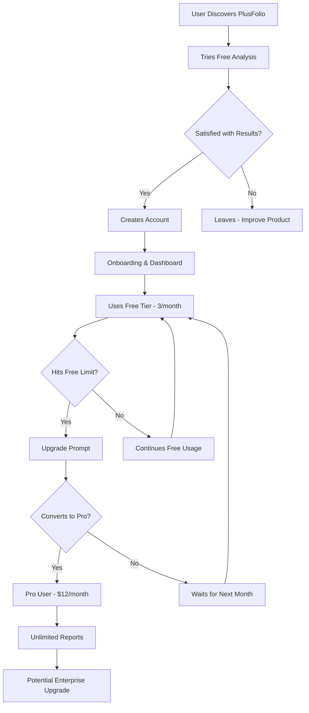

---

## 👤 **User Personas & Journey Maps**

### **Primary Persona 1: Portfolio Developer**

#### **Profile**
- **Name**: Alex Chen
- **Age**: 28
- **Role**: Frontend Developer (3 years experience)
- **Goal**: Land a senior role at a tech startup
- **Pain Points**: Portfolio looks too technical, lacks design polish
- **Budget**: Limited, prefers free/low-cost tools

#### **User Journey Map**
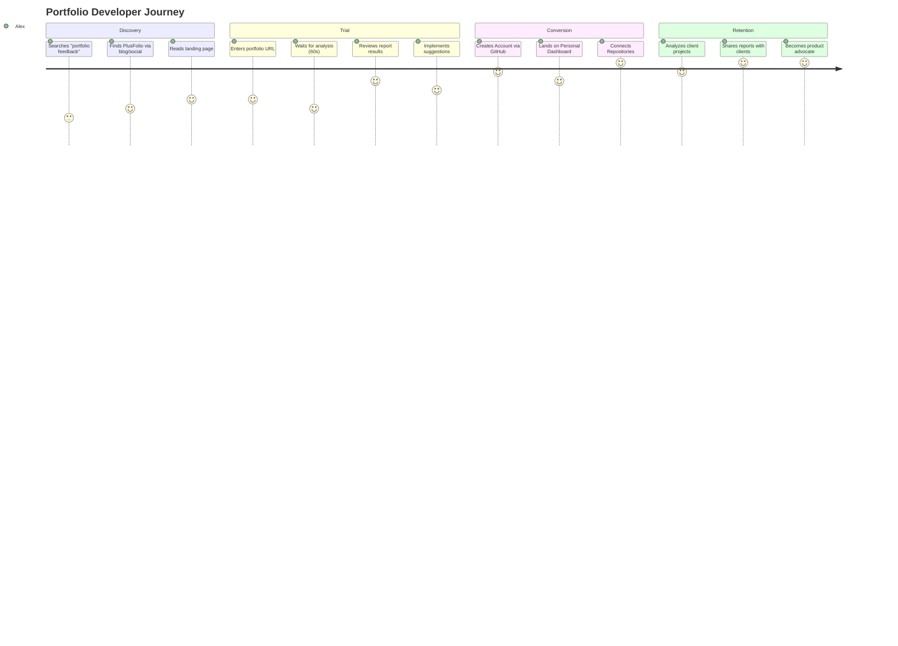

#### **Detailed Journey Steps**

**Phase 1: Discovery & Initial Trial**
```
1. Problem Recognition
   - Alex realizes portfolio isn't getting responses
   - Searches "website design feedback tools"
   - Discovers PlusFolio through content marketing

2. First Impression
   - Lands on homepage, sees clear value prop
   - Likes developer-focused messaging
   - Impressed by 60-second promise

3. Trial Usage
   - Enters portfolio URL without signing up
   - Experiences smooth analysis process
   - Gets actionable feedback with visual examples
   - Satisfaction: 8/10
```

**Phase 2: Account Creation & Free Usage**
```
4. Account Registration
   - Creates account to save report
   - Uses GitHub or Google OAuth for a 1-click signup
   - Is redirected to their new personal dashboard
   - Follows onboarding prompts to connect their GitHub account
   - Imports their top 3 repositories to their portfolio profile

5. Free Tier Exploration
   - Analyzes personal projects from the dashboard
   - Tests different page types
   - Shares report with developer friends
   - Uses 2-3 reports per month consistently
```

**Phase 3: Conversion Decision**
```
6. Limit Encounter
   - Hits 3-report monthly limit
   - Needs to analyze new project for job application
   - Sees upgrade prompt with clear benefits

7. Conversion Evaluation
   - Considers $12/month value vs. manual feedback
   - Calculates ROI: one job offer = 100x value
   - Subscribes to Pro tier
```

**Phase 4: Pro User Experience**
```
8. Pro Benefits Realization
   - Unlimited reports for client work
   - PDF exports for professional presentations
   - Advanced analysis modes for different audiences
   - Becomes regular user (5-10 reports/month)
```

### **Primary Persona 2: Early-Stage Founder**

#### **Profile**
- **Name**: Maria Rodriguez
- **Age**: 32
- **Role**: Technical Co-founder, Pre-Series A Startup
- **Goal**: Validate MVP design before investor meetings
- **Pain Points**: No design budget, need professional appearance
- **Budget**: Moderate, willing to pay for business tools

#### **User Journey Map**
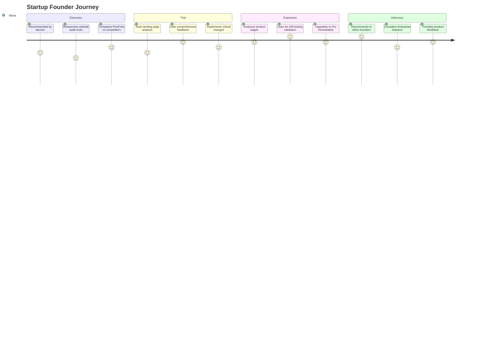

### **Secondary Persona 3: Freelance Designer**

#### **Profile**
- **Name**: David Park
- **Age**: 35
- **Role**: Freelance Web Designer
- **Goal**: Provide better client deliverables
- **Pain Points**: Client questions about design decisions
- **Budget**: Business expense, ROI-focused

#### **User Journey Map**
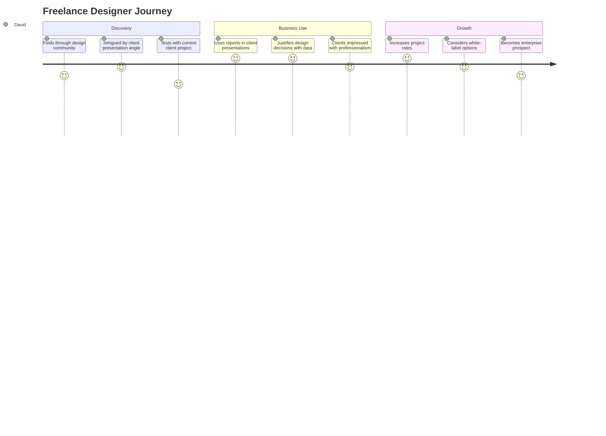

---

## 🔄 **Core Business Flows**

### **1. User Acquisition Flow**

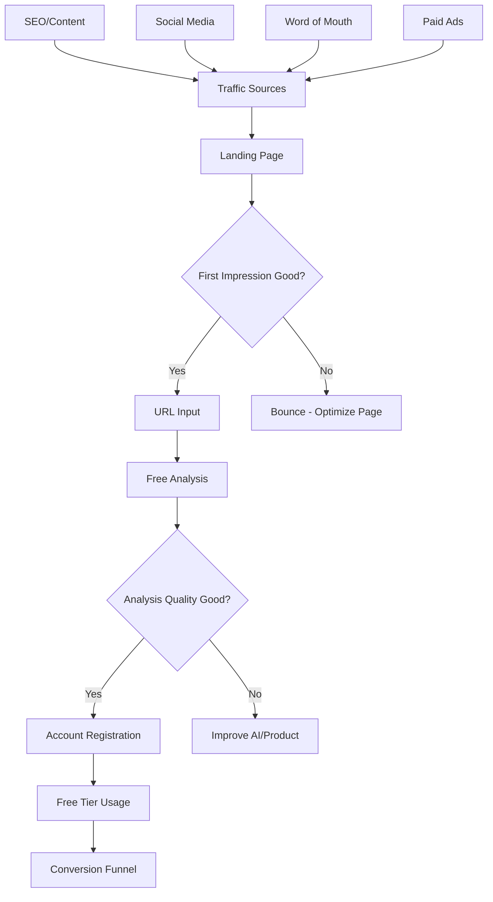

**Acquisition Metrics**:
- **Traffic → Trial Rate**: Target 15%
- **Trial → Satisfaction**: Target 80%
- **Satisfaction → Registration**: Target 60%
- **Registration → Active**: Target 70%

### **2. Free-to-Paid Conversion Flow**

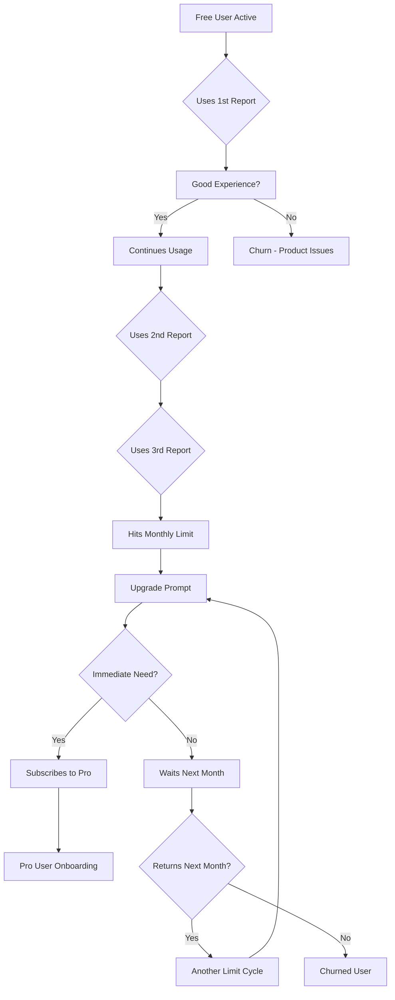

**Conversion Metrics**:
- **Free → Pro Conversion**: Target 8%
- **Time to Conversion**: Average 2-3 months
- **Upgrade Prompt CTR**: Target 25%
- **Trial-to-Paid**: Target 15%

### **3. Customer Retention Flow**

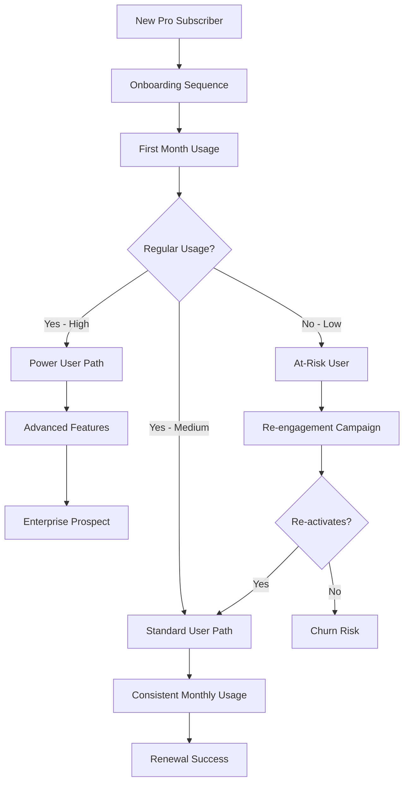

**Retention Metrics**:
- **Month 1 Retention**: Target 80%
- **Month 3 Retention**: Target 60%
- **Month 12 Retention**: Target 40%
- **Monthly Churn Rate**: Target <10%

---

## 💰 **Revenue Flow Architecture**

### **Revenue Stream Breakdown**

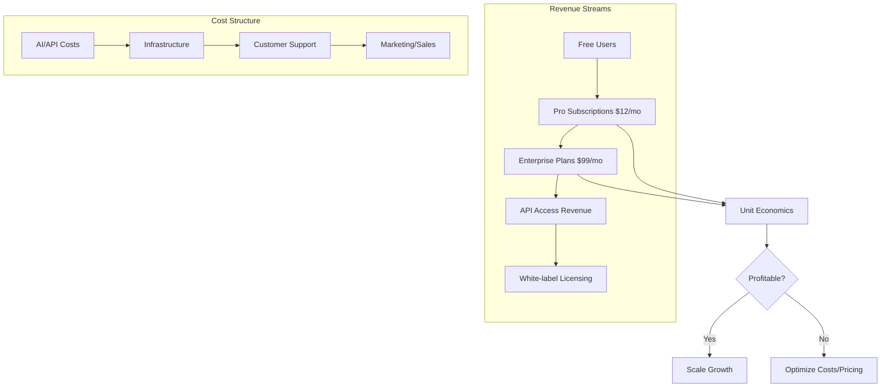

### **Unit Economics Model**

#### **Free User Economics**
- **Cost per Free User**: $0.10/month (infrastructure + AI)
- **Conversion Rate**: 8% to Pro
- **Time to Conversion**: 2.5 months average
- **Customer Acquisition Cost**: $15 average

#### **Pro User Economics**
- **Monthly Revenue**: $12
- **Monthly Cost**: $2 (AI + infrastructure + support)
- **Gross Margin**: $10 (83%)
- **Lifetime Value**: $180 (18 months average)
- **LTV:CAC Ratio**: 12:1 (excellent)

#### **Enterprise User Economics**
- **Monthly Revenue**: $99
- **Monthly Cost**: $8 (higher usage + dedicated support)
- **Gross Margin**: $91 (92%)
- **Lifetime Value**: $1,200 (2+ years average)
- **Sales Cost**: $200 (higher touch sales process)

---

## 🎯 **Customer Success Flow**

### **Onboarding Journey**

This flow begins immediately after a user successfully creates an account.

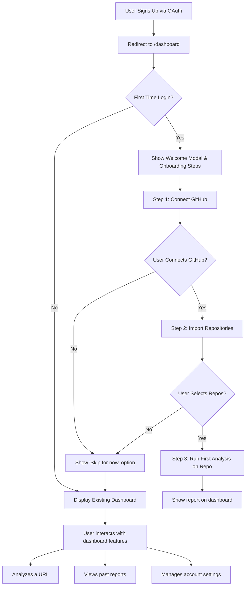

#### **Email Sequence for New Users**
```
Day 0: Welcome & Your New Dashboard
- Welcome message with quick start guide
- Link to product tour and best practices
- Encourage first report analysis

Day 3: Tips & Best Practices
- How to get the most from analysis
- Common mistakes to avoid
- Success stories from other users

Day 7: Feature Spotlight
- Advanced features they haven't used
- Analysis modes for different audiences
- Export and sharing capabilities

Day 14: Feedback Request
- Survey about their experience
- Feature requests and suggestions
- Offer of personalized demo if needed

Day 30: Conversion Nudge
- Usage summary and value delivered
- Comparison of free vs. pro benefits
- Limited-time upgrade incentive
```

### **Customer Support Flow**

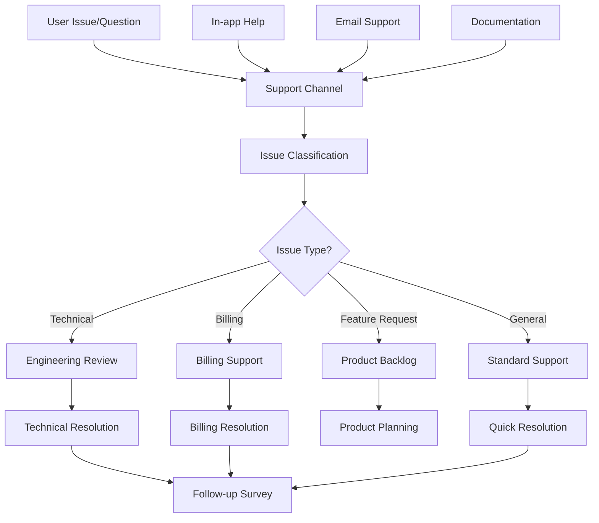

---

## 📈 **Growth & Scaling Flows**

### **Viral Growth Mechanisms**

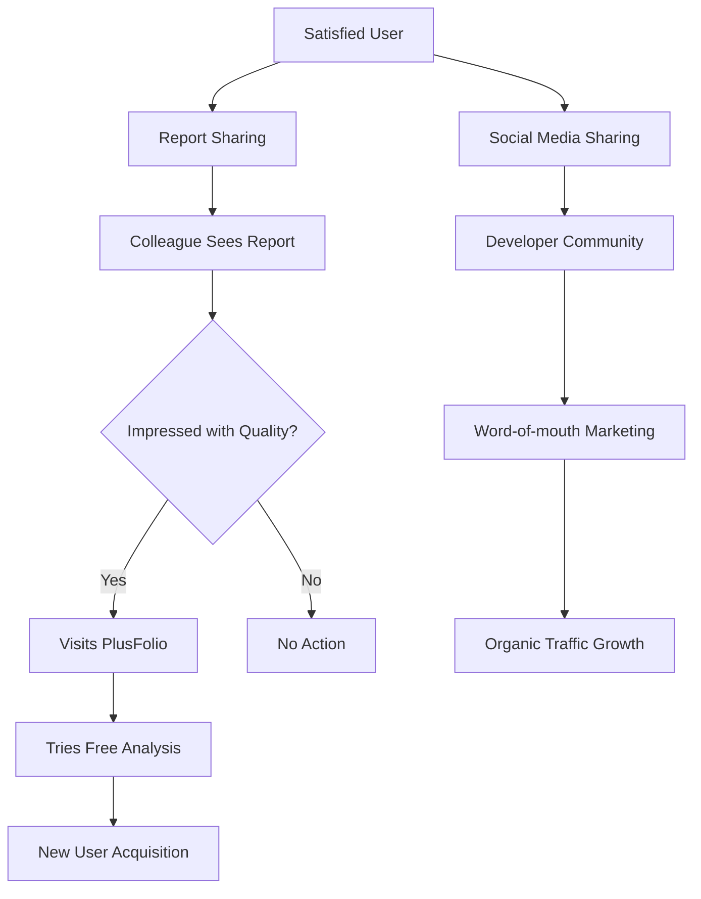

#### **Referral Program Flow**
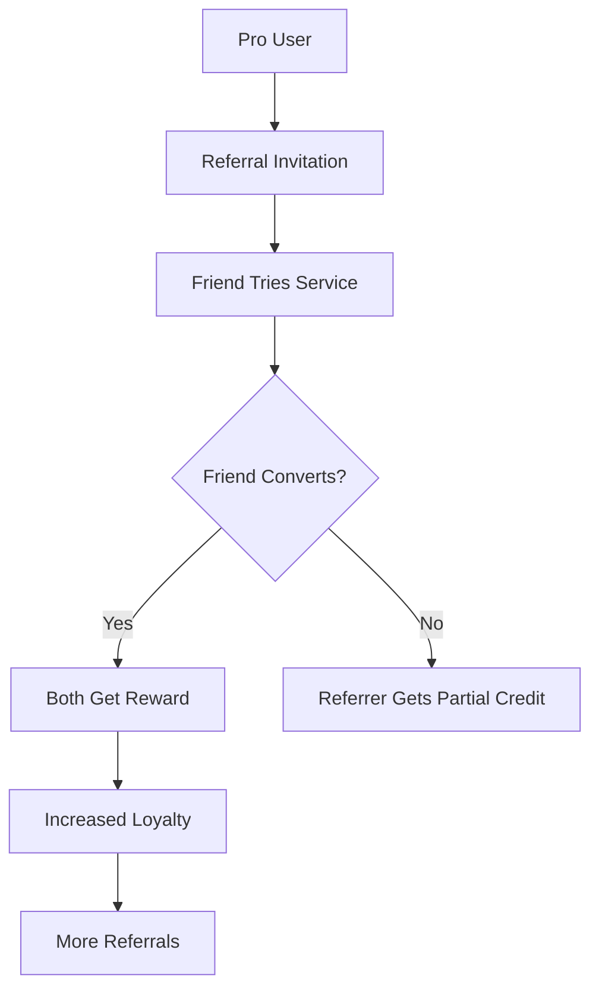

### **Content Marketing Flow**

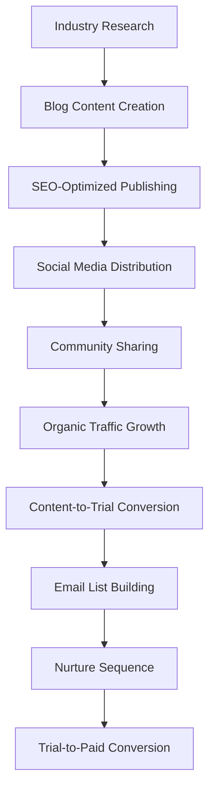

---

## 🔄 **Operational Workflows**

### **Daily Operations Flow**

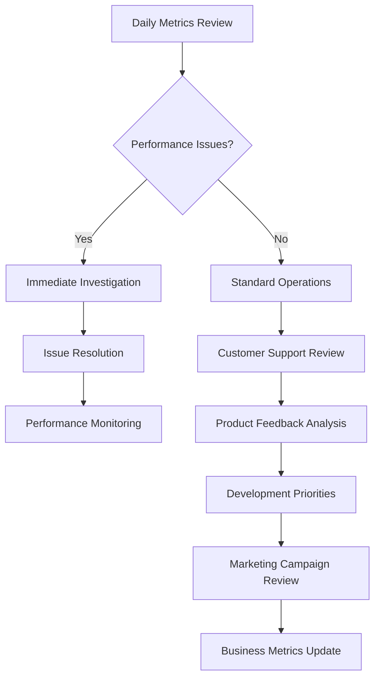

### **Weekly Review Process**

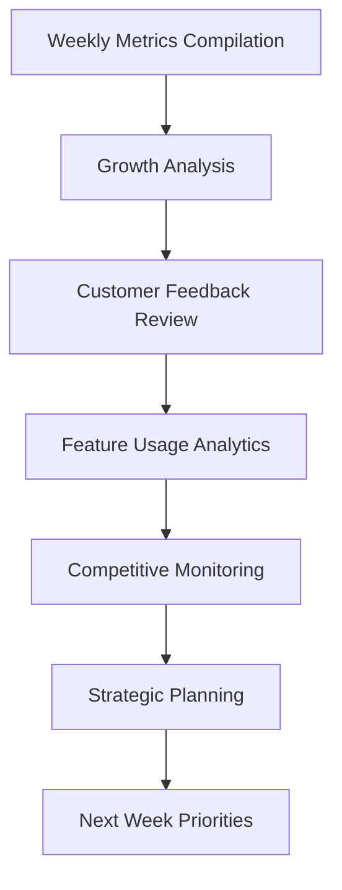

#### **Key Weekly Metrics**
| **Category** | **Metric** | **Target** | **Action Threshold** |
|:-------------|:-----------|:-----------|:---------------------|
| **Growth** | Weekly Active Users | +15% MoM | <10% MoM |
| **Conversion** | Trial-to-Paid | 8% | <5% |
| **Retention** | Monthly Churn | <10% | >15% |
| **Quality** | Report Rating | 4.2/5 | <4.0/5 |
| **Performance** | Analysis Time | <60s | >90s |

---

## 🎯 **Customer Lifecycle Management**

### **Lifecycle Stages & Interventions**

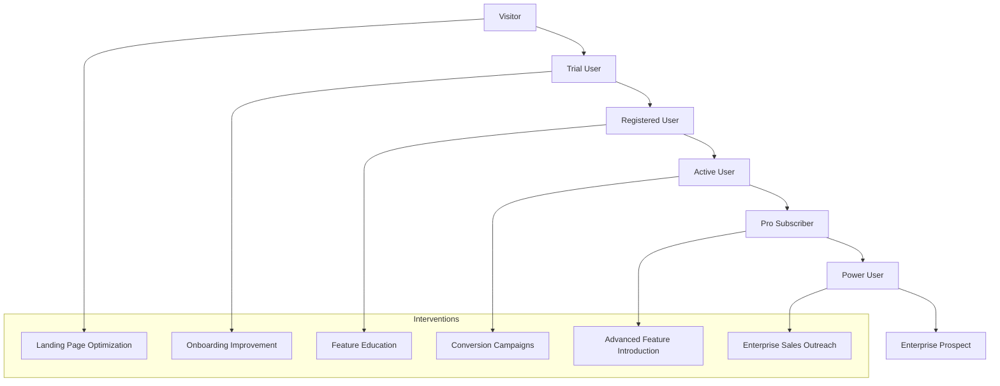

#### **Stage-Specific Actions**

**Visitor → Trial User**
- **Goal**: Maximize trial conversion rate
- **Actions**: A/B test landing page, improve value prop clarity
- **Success Metric**: 15% visitor-to-trial conversion

**Trial User → Registered User**
- **Goal**: Capture user information for nurturing
- **Actions**: Require registration for report saving, provide immediate value
- **Success Metric**: 60% trial-to-registration conversion

**Registered User → Active User**
- **Goal**: Drive regular usage and engagement
- **Actions**: Email nurturing, feature education, usage reminders
- **Success Metric**: 70% registration-to-active conversion

**Active User → Pro Subscriber**
- **Goal**: Convert to paid subscription when ready
- **Actions**: Limit-based upgrade prompts, value demonstration
- **Success Metric**: 8% active-to-paid conversion

**Pro Subscriber → Power User**
- **Goal**: Maximize usage and satisfaction
- **Actions**: Advanced feature introduction, workflow optimization
- **Success Metric**: >10 reports/month usage

**Power User → Enterprise Prospect**
- **Goal**: Identify and nurture enterprise opportunities
- **Actions**: Usage-based outreach, enterprise feature preview
- **Success Metric**: 5% power user enterprise conversion

---

## 📊 **Success Metrics & KPIs**

### **Primary Business Metrics**

#### **Acquisition Metrics**
- **Website Traffic**: Monthly unique visitors
- **Trial Conversion**: % of visitors who submit first URL
- **Registration Rate**: % of trial users who create accounts
- **Time to First Value**: Minutes to complete first analysis

#### **Activation Metrics**
- **Onboarding Completion**: % who complete setup process
- **First Week Retention**: % who return within 7 days
- **Feature Adoption**: % using key features (sharing, modes)
- **Satisfaction Score**: Average rating of analysis quality

#### **Revenue Metrics**
- **Free-to-Paid Conversion**: % of free users upgrading
- **Monthly Recurring Revenue**: Total subscription revenue
- **Average Revenue Per User**: Monthly revenue per subscriber
- **Customer Lifetime Value**: Total revenue per customer

#### **Retention Metrics**
- **Monthly Churn Rate**: % of subscribers canceling
- **Net Revenue Retention**: Revenue growth from existing customers
- **Usage Frequency**: Average reports per user per month
- **Support Ticket Volume**: Issues per 1000 users

### **Product Quality Metrics**

#### **Performance Metrics**
- **Analysis Speed**: Average time to complete analysis
- **System Uptime**: % of time service is available
- **Error Rate**: % of analyses that fail
- **API Response Time**: Average external API response

#### **User Experience Metrics**
- **Task Success Rate**: % of successful analysis completions
- **User Effort Score**: Ease of using the platform
- **Feature Discovery**: % of users finding key features
- **Mobile Usage**: % of traffic from mobile devices

---

## 🔄 **Continuous Improvement Flow**

### **Feedback Collection & Analysis**

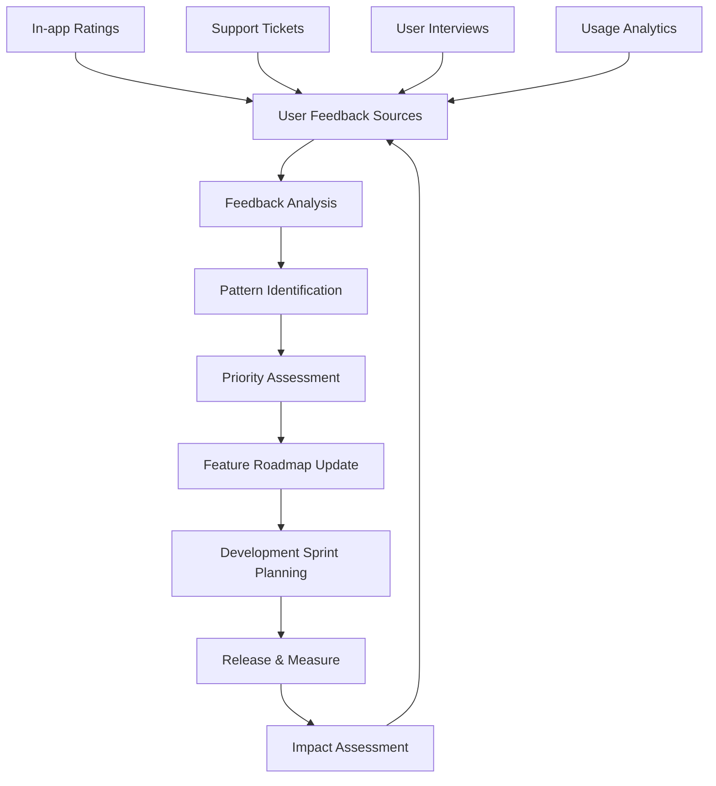

### **A/B Testing Framework**

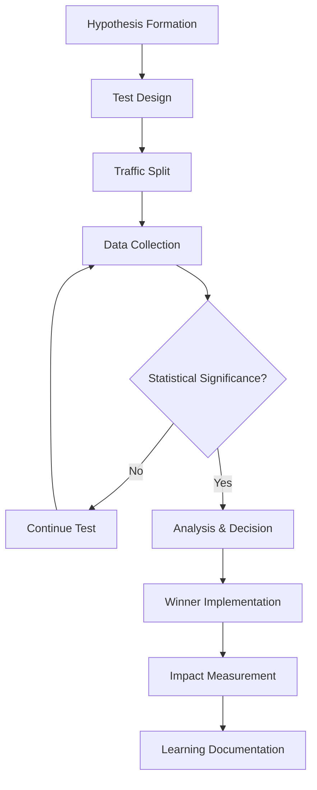

#### **Key Areas for A/B Testing**
1. **Landing Page**: Headlines, CTAs, social proof placement
2. **Onboarding**: Flow length, required steps, guidance
3. **Upgrade Prompts**: Timing, messaging, incentives
4. **Report Format**: Layout, detail level, visualization
5. **Pricing Page**: Price points, feature presentation, testimonials

---

## 🎯 **Next Steps & Implementation**

### **Phase 1: Foundation (Weeks 1-8)**
- [ ] **Implement core user flows**: Registration, analysis, reporting
- [ ] **Setup analytics tracking**: Key events, conversion funnels
- [ ] **Create onboarding sequence**: Welcome emails, product tour
- [ ] **Build support infrastructure**: Help docs, ticket system

### **Phase 2: Optimization (Weeks 9-16)**  
- [ ] **Launch A/B testing program**: Conversion optimization
- [ ] **Implement referral system**: Viral growth mechanism
- [ ] **Build customer success workflows**: Retention campaigns
- [ ] **Setup advanced analytics**: Cohort analysis, churn prediction

### **Phase 3: Scaling (Weeks 17-24)**
- [ ] **Enterprise sales process**: High-value customer acquisition
- [ ] **API product launch**: New revenue stream
- [ ] **International expansion**: Multi-language support
- [ ] **Partner program**: Agency and reseller channels

---

**Business Flow Documentation Complete**: ✅ All major flows documented with diagrams  
**Success Metrics Defined**: ✅ KPIs and targets established  
**Implementation Roadmap**: ✅ Clear next steps for business operations  

**Next Steps**: Begin implementing user acquisition flows while building the core product, focusing on creating a seamless experience that drives natural conversion from free to paid tiers.