# Technical & Business Process Flowcharts: PlusFolio

**Document Version:** 1.0  
**Date:** August 23, 2025  
**Author:** Systems Architecture Team  
**Status:** Complete Process Documentation

---

## 🔧 **Technical Architecture Flowcharts**

### **1. System Overview Architecture**

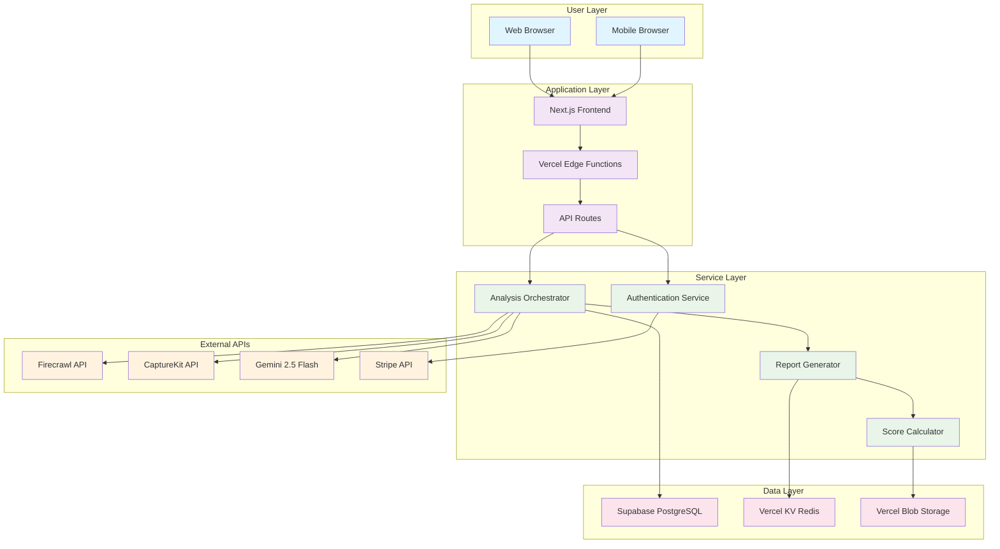

### **2. Website Analysis Technical Flow**

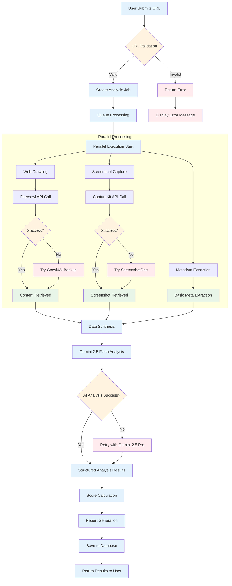

### **3. Database Operations Flow**

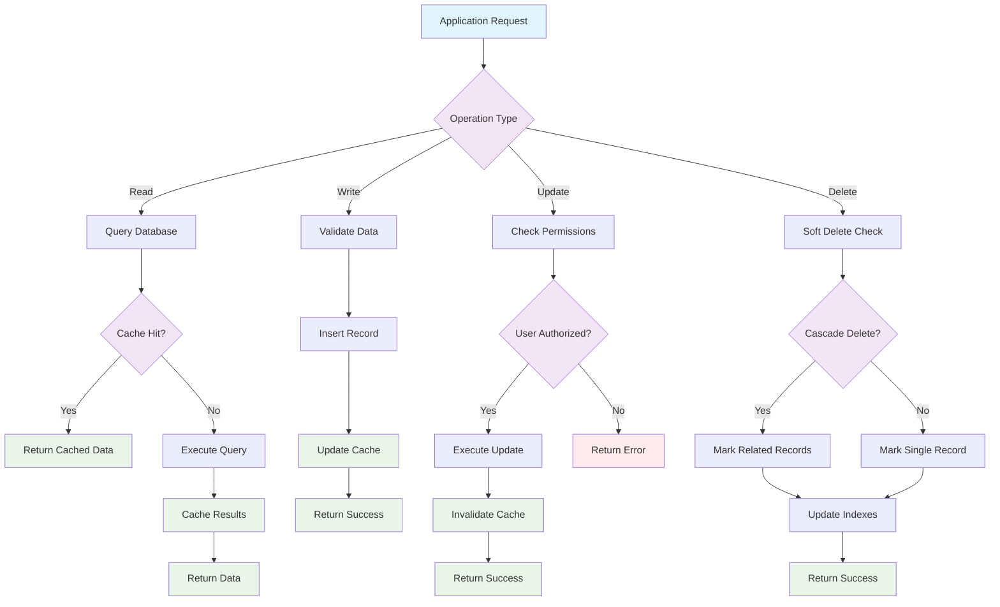

### **4. Authentication & Authorization Flow**

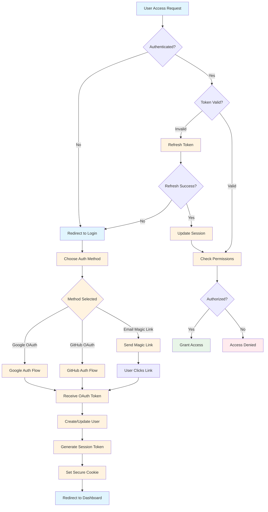

### **5. Payment Processing Flow**

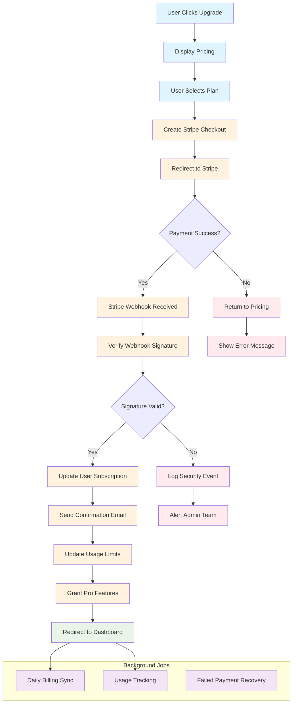

---

## 🏢 **Business Process Flowcharts**

### **6. Customer Acquisition Funnel**

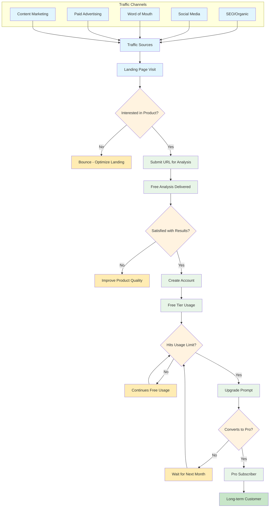

### **7. Customer Success Journey**

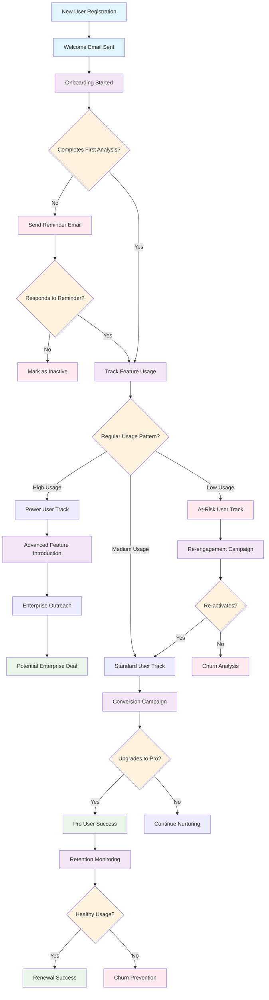

### **8. Product Development Workflow**

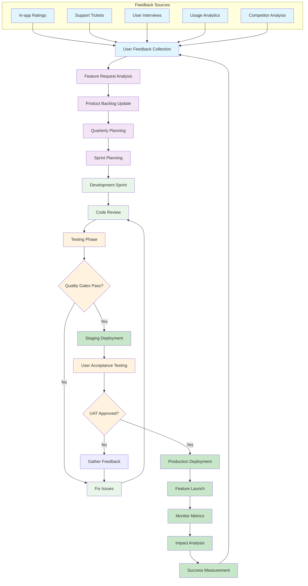

### **9. Customer Support Process**

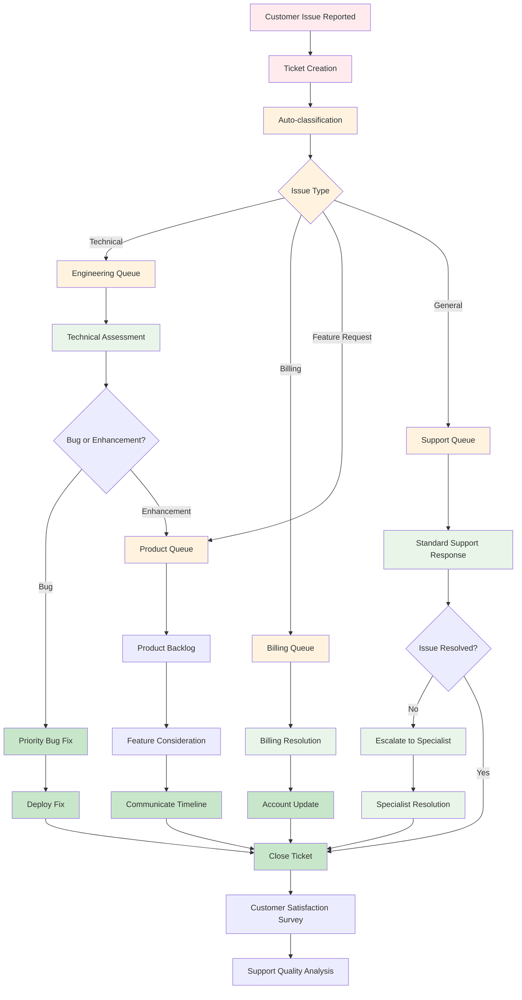

### **10. Revenue Recognition & Analytics**

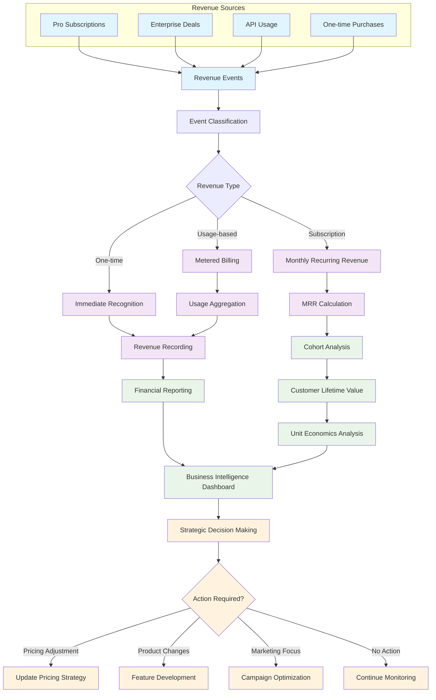

---

## 🔄 **Integration & Data Flow Diagrams**

### **11. API Integration Architecture**

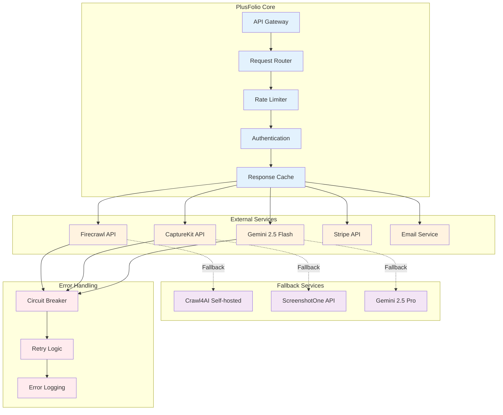

### **12. Data Processing Pipeline**

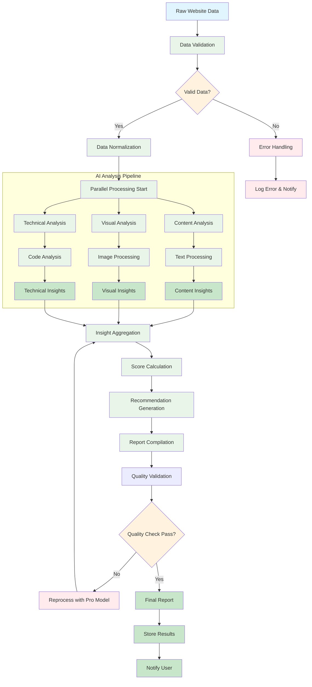

### **13. User Activity Tracking Flow**

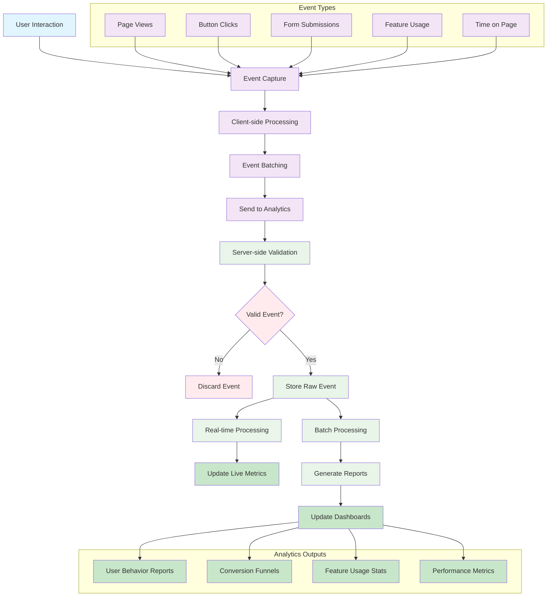

---

## 📊 **Monitoring & Alerting Flowcharts**

### **14. System Health Monitoring**

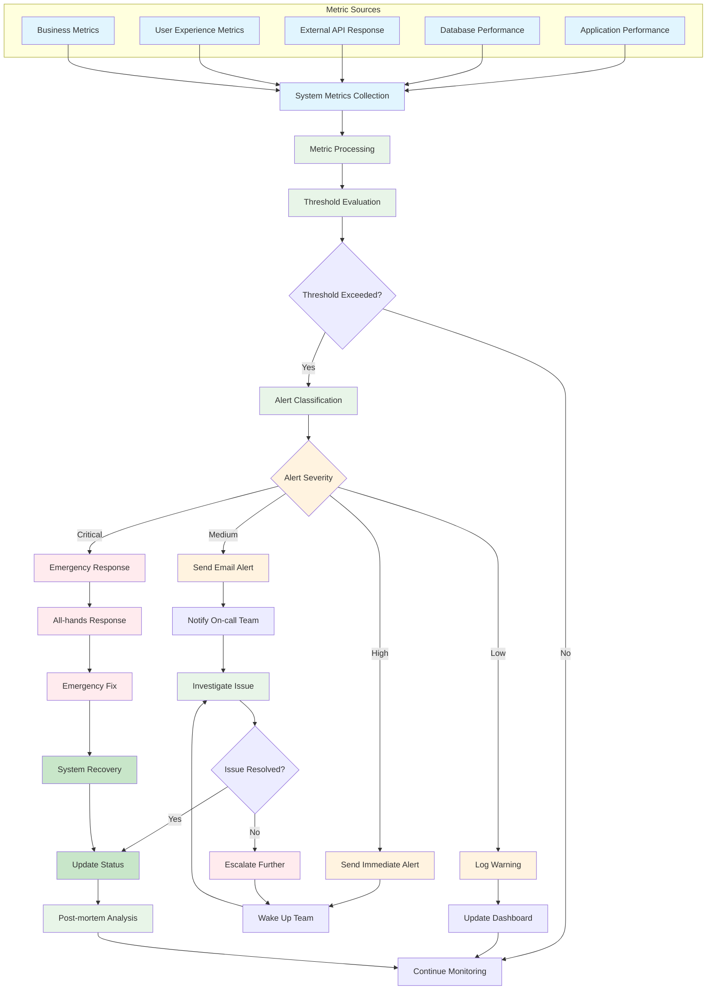

### **15. Performance Optimization Flow**

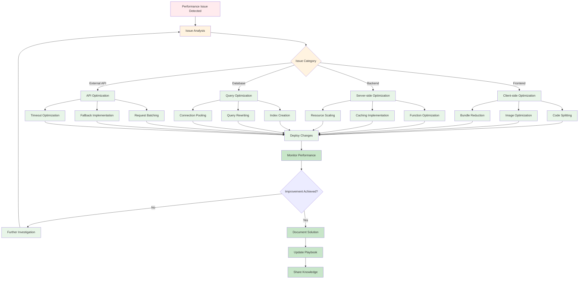

---

## 🎯 **Implementation Roadmap Flowchart**

### **16. Development Phase Flow**

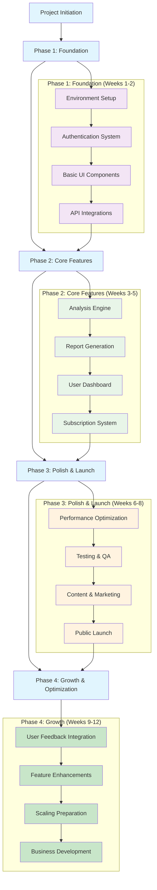

---

## 🎯 **Summary & Next Steps**

### **Flowchart Implementation Checklist**

#### **Technical Flowcharts**
- [ ] **System Architecture**: Reference for infrastructure setup
- [ ] **Analysis Flow**: Core product functionality guide
- [ ] **Database Operations**: Data management implementation
- [ ] **Authentication**: Security implementation guide
- [ ] **Payment Processing**: Monetization flow setup

#### **Business Process Flowcharts**
- [ ] **Customer Acquisition**: Marketing and sales process
- [ ] **Customer Success**: Retention and growth strategies
- [ ] **Product Development**: Feature development workflow
- [ ] **Support Process**: Customer service operations
- [ ] **Revenue Analytics**: Financial tracking and analysis

#### **Integration Flowcharts**
- [ ] **API Integration**: External service management
- [ ] **Data Pipeline**: Information processing flow
- [ ] **User Tracking**: Analytics implementation
- [ ] **Health Monitoring**: System reliability
- [ ] **Performance Optimization**: Continuous improvement

### **Usage Guidelines**

1. **Development Phase**: Use technical flowcharts as implementation guides
2. **Operations Phase**: Reference business process flowcharts for daily operations
3. **Scaling Phase**: Follow integration flowcharts for system expansion
4. **Optimization Phase**: Use monitoring flowcharts for continuous improvement

### **Diagram Maintenance**

- **Update Frequency**: Review and update diagrams monthly
- **Version Control**: Track changes to process flows
- **Team Alignment**: Use diagrams in team meetings and onboarding
- **Documentation**: Keep flowcharts synchronized with actual implementation

---

**Complete Flowchart Documentation**: ✅ 16 comprehensive diagrams covering all major processes  
**Technical Implementation Guide**: ✅ Detailed flows for development team  
**Business Operations Manual**: ✅ Process flows for business operations  
**Integration Architecture**: ✅ System integration and monitoring guides  

**Next Steps**: Use these flowcharts as implementation guides during development, reference them for operational decisions, and update them as processes evolve.